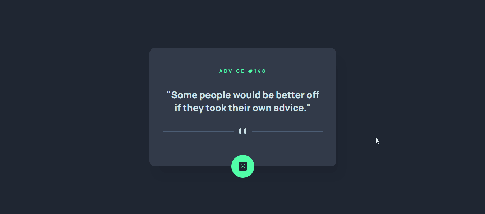

<div align='center'>

# App Gerador de Conselhos


</div>

Esta é uma solução do [Advice generator app challenge](https://www.frontendmentor.io/challenges/advice-generator-app-QdUG-13db) do site Frontend Mentor.  
O Frontend Mentor oferece diversos desafios que visam melhor nossas habilidades em codificar, construindo projetos similares ao que o mercado exige.

## Tabela de conteúdos

- [Visão Geral](#visao-geral)
  - [Desafio](#desafio)
  - [Funcionamento](#funcionamento)
  - [Links](#links)
- [Processo de desenvolvimento](#processo-de-desenvolvimento)
  - [Construído com](#construído-com)
  - [O que aprendi](#o-que-aprendi)
  - [Aprimoramento contínuo](#aprimoramento-contínuo)
  - [Links úteis](#links-úteis)
- [Autor](#autor)
- [Agradecimentos](#agradecimentos)

## Visão Geral

### Desafio

Usuários poderão:

- Visualizar o projeto em qualquer tamanho de tela, devido a sua responsividade
- Visualizar os estados de hover em todos os elementos interativos do projeto
- Gerar um novo conselho a cada clique no botão, personalizado com o ícone de um dado

### Funcionamento



### Links

- Endereço da solução: [Clique aqui para acessar o repositório do projeto](https://github.com/Hugo-Moreira91/gerador-de-conselhos)
- Live Site URL: [Clique aqui para visualizar o projeto via GitHub Pages](https://hugo-moreira91.github.io/gerador-de-conselhos/)

## Processo de desenvolvimento

### Construído com

- Marcações semânticas HTML5 para estruturação
- Propriedades CSS customizadas para estilização
- Flexbox
- Responsividade
- [Advice Slip JSON API](https://api.adviceslip.com/)

### O que aprendi

- Uso da tag \<picture> para a exibição da linha entre o conselho e o botão, onde foi definido a alteração da imagem para dispositivos com até 450 pixels de largura.

```html
  <picture>
      <source srcset="./src/images/pattern-divider-mobile.svg" media="(max-width: 450px)">
      
  </picture>
```

Com isso, evita-se a necessidade de realizar a troca da imagem no arquivo destinado a responsividade do projeto.

- Utilização da API geradora de conselhos. Para isso, utilizou-se a função *fetch()* no endpoint da API (requisição). 

- O uso do *async* *await* para transformar as funções em assíncronas, bem como as respostas em objetos, respectivamente.

- Uso do *try* *catch* para capturar eventuais erros, para que os mesmos possam ser tratados.

- Com o objeto JSON extraído, utilizou-se as propriedades **id** e **advise** para alterar, respectivamente, o número do conselho e o conselho em si, a cada clique no botão. Para ter o efeito desejado, a propriedade **innerText** dos elementos HTML no DOM foi a escolhida, uma vez que a atribuição ficou restrita a textos.

- Uso do parâmetro literal para a exibição dos conselhos envolvidos em aspas duplas.

### Aprimoramento contínuo

Devo buscar aplicar e aprimorar a integração de API's em projetos futuros. Saber utilizar requisições, bem como extrair as respostas e informações úteis, de acordo com a situação proposta. Sem dúvidas isso será de grande valia para o meu crescimento como desenvolvedor.

### Links úteis

Abaixo seguem links de pesquisas os quais consultei para realizar o projeto:

- [Funções assíncronas](https://developer.mozilla.org/pt-BR/docs/Web/JavaScript/Reference/Statements/async_function) - Auxiliou-me na construção das funções assíncronas, importantes em requisições de API's
- [Método addEventListener()](https://www.w3schools.com/js/js_htmldom_eventlistener.asp) - Auxiliou-me na geração de novos conselhos a partir do clique sobre o botão. Ótimo site para esses e outros assuntos relacionados ao desenvolvimento web - [w3schools](https://www.w3schools.com/)
- [Documentação da API utilizada no projeto](https://api.adviceslip.com/) - Importante documentação para auxiliar no desenvolvimento do projeto, com informações referentes ao endpoint que deve ser utilizado para a requisição, bem como a estrutura do objeto de resposta.

## Autor

- LinkedIn - [Hugo Moreira](https://www.linkedin.com/in/hugo-c%C3%A9sar-santos-moreira-a10823248/)
- GitHub - [@Hugo-Moreira91](https://github.com/Hugo-Moreira91)
- Frontend Mentor - [@Hugo-Moreira91](https://www.frontendmentor.io/profile/Hugo-Moreira91)

Sempre em busca de conhecimento 🚀

Feito com ❤️

## Agradecimentos

Agradecer aos conhecimentos passados pelos irmãos Roberto e Ricardo Dias, do [Dev em Dobro](https://www.instagram.com/devemdobro/#), em seu curso de desenvolvedor web full stack, denominado Dev Quest, bem como toda a sua comunidade no Discord.